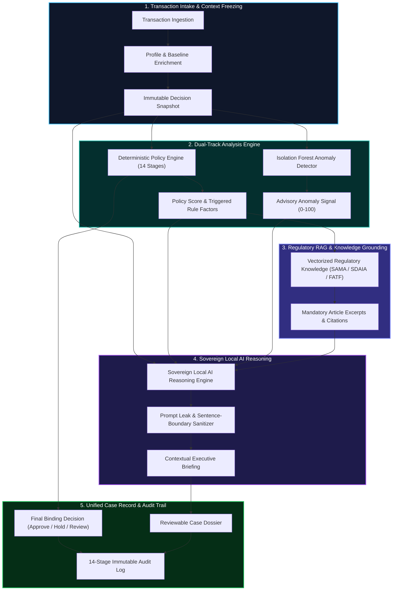

# SentinelAI — Enterprise Local Risk Intelligence & Transaction Governance

<div align="center">


<br/>

**نظام مصرفي ذكي ومحوكم لتقييم مخاطر الحوالات المالية بالاستدلال المحلي، كشف الشذوذ الإحصائي، والامتثال التنظيمي الموثق.**  
*An enterprise-grade, privacy-first transaction risk review platform combining deterministic rule engines, Isolation Forest behavioral anomaly detection, and localized Sovereign AI reasoning.*

</div>

---

## 📑 Table of Contents
1. [Executive Summary](#1-executive-summary)
2. [Core Architecture & Intelligence Pipeline](#2-core-architecture--intelligence-pipeline)
3. [AI Readiness & Standardization Contribution](#3-ai-readiness--standardization-contribution)
4. [Algorithmic & Mathematical Specifications](#4-algorithmic--mathematical-specifications)
5. [14-Stage Immutable Audit Trail](#5-14-stage-immutable-audit-trail)
6. [Regulatory Alignment & RAG Grounding](#6-regulatory-alignment--rag-grounding)
7. [Interactive Operations Workspace](#7-interactive-operations-workspace)
8. [System Benchmark & Test Matrix](#8-system-benchmark--test-matrix)
9. [Installation & Local Deployment](#9-installation--local-deployment)
10. [Engineering Changelog & Milestones](#10-engineering-changelog--milestones)

---

## 1. Executive Summary

In mission-critical financial ecosystems, transaction screening models face two fundamental operational failure modes:
1. **The "Black-Box" Deficit:** High-capacity deep learning models offer opaque predictions, making them non-defensible during regulatory audits and court inquiries.
2. **Rigid Rule Stagnation:** Traditional hard-coded rules cannot detect subtle behavioral shifts, coordinated velocity attacks, or novel synthetic identity fraud.

**SentinelAI** bridges this divide with an **Air-Gapped, Hybrid Governance Architecture**:
- **Deterministic Hard Boundaries:** 100% auditable policy rules that own final authority and enforce mandatory overrides.
- **Statistical Behavioral Baselines:** Real-time customer profile drift analysis ($z$-score deviations on velocity, timing, and amounts).
- **Isolation Forest Anomaly Scoring:** Unsupervised anomaly scoring providing early warning advisory signals without hallucinating rule factors.
- **Sovereign Local AI Reasoning:** On-premise / edge language models producing contextual Arabic and English narratives grounded solely in frozen decision records.
- **Zero PII Leakage:** Sensitive banking payloads are tokenized and processed within local boundaries, eliminating third-party API exposure.

---

## 2. Core Architecture & Intelligence Pipeline



---

## 3. AI Readiness & Standardization Contribution

SentinelAI introduces an open, repeatable standard for financial data readiness and governed AI evaluation, bridging multi-source banking streams into structured risk intelligence:

- **Multi-Source Data Unification:** Standardizes disparate banking inputs (core transaction payload, 90-day customer behavioral baseline, merchant domain threat indicators, and cryptographic provenance) into a unified, validated schema ([`docs/finance-data-readiness-schema.json`](./docs/finance-data-readiness-schema.json)).
- **Sovereign RAG & LLM Governance:** Enforces rigid prompt fences, bidirectional leakage filters, and non-bypassable mandatory rules over sovereign local reasoning models (Local Sovereign AI / Air-Gapped Engine) as formalized in the published [GenAI & RAG Governance Profile](./docs/finance-genai-rag-governance-profile.md).
- **ITU-T Y.3172 Standardization:** Formally maps every pipeline entity to the standard `SRC`, `C`, `PP`, `M`, `P`, `D`, and `SINK` architectural components ([`docs/architecture.md`](./docs/architecture.md)).

---

## 4. Algorithmic & Mathematical Specifications

### 3.1 Composite Policy Scoring Function
The deterministic risk score $S_{\text{policy}} \in [0, 100]$ is calculated through an accumulator function over activated policy factor weights $w_i \in \mathbb{R}^+$, adjusted for multi-signal velocity escalation:

$$S_{\text{policy}} = \min\left(100, \sum_{i \in \mathcal{F}_{\text{active}}} w_i + \Delta_{\text{escalation}}(\mathcal{F}_{\text{active}})\right)$$

Where:
- $\mathcal{F}_{\text{active}}$ is the set of triggered rule factors (e.g., $w_{\text{domain\_risk}} = 35$, $w_{\text{amount\_deviation}} = 20$, $w_{\text{new\_beneficiary}} = 15$).
- $\Delta_{\text{escalation}} = 10$ if $|\mathcal{F}_{\text{active}}| \ge 3$ and includes both behavioral and corridor triggers.

### 3.2 Mandatory Policy Override Function
Certain high-risk conditions trigger an immediate non-bypassable decision override:

$$\mathcal{D}(S_{\text{policy}}, \mathcal{C}) = 
\begin{cases} 
\text{Manual Review}, & \text{if } \exists c \in \mathcal{C} \text{ where } c = \text{HighRiskDomain} \\
\text{Manual Review}, & \text{if } S_{\text{policy}} \ge 80 \\
\text{Temporary Hold}, & \text{if } 50 \le S_{\text{policy}} < 80 \\
\text{Additional Verification}, & \text{if } 30 \le S_{\text{policy}} < 50 \\
\text{Approve}, & \text{if } S_{\text{policy}} < 30 
\end{cases}$$

> **Key Rule:** Machine learning and generative AI models **cannot** lower or override a policy score or supersede a mandatory compliance hold.

### 3.3 Behavioral Baseline Drift Formula
The transaction amount deviation ratio $\delta_{\text{amount}}$ is measured against the historical customer mean $\mu_{\text{baseline}}$ and standard deviation $\sigma_{\text{baseline}}$:

$$\delta_{\text{amount}} = \frac{x_{\text{tx}}}{\max(1, \mu_{\text{baseline}})}, \quad z_{\text{score}} = \frac{x_{\text{tx}} - \mu_{\text{baseline}}}{\sigma_{\text{baseline}} + \epsilon}$$

Deviation thresholds:
- If $\delta_{\text{amount}} \ge 2.5\times$, activate **Major Amount Deviation** ($+20$ pts).
- If transfer hour $t \notin [h_{\text{start}}, h_{\text{end}}]$, activate **Off-Hours Anomaly** ($+10$ pts).

---

## 5. 14-Stage Immutable Audit Trail

Every transaction analysis undergoes a rigorous 14-stage lifecycle where each stage logs timestamp, input hash, decision payload, and execution metrics:

| Stage | Identifier | Operation Description |
|:---:|:---|:---|
| `01` | `INTAKE_INGEST` | Ingestion and normalization of transaction metadata |
| `02` | `BASELINE_FETCH` | Retrieval of historical customer baseline parameters |
| `03` | `CORRIDOR_EVAL` | Assessment of geographic destination & sanction lists |
| `04` | `BENEFICIARY_CHECK`| Verification of counterparty history & onboarding age |
| `05` | `DOMAIN_REPUTATION`| Deterministic lookup of merchant web infrastructure |
| `06` | `VELOCITY_ANALYSIS` | Windowed transaction count and cumulative volume check |
| `07` | `POLICY_WEIGHT_SUM` | Aggregation of deterministic rule factor weights |
| `08` | `OVERRIDE_GATE` | Evaluation of mandatory compliance override rules |
| `09` | `ANOMALY_INFERENCE` | Isolation Forest multi-dimensional outlier scoring |
| `10` | `DECISION_FREEZE` | Creation of cryptographic, immutable decision snapshot |
| `11` | `RAG_RETRIEVAL` | Vector lookup of relevant SAMA / SDAIA / FATF clauses |
| `12` | `LOCAL_AI_SYNTH` | Sovereign AI generation of bilingual executive analysis |
| `13` | `CASE_ALERT_SYNC` | Automatic generation of case files and escalation alerts |
| `14` | `AUDIT_SEAL` | Finalizing the tamper-evident audit record |

---

## 6. Regulatory Alignment & RAG Grounding

SentinelAI integrates contextual excerpts from recognized supervisory frameworks directly into the investigation workspace:

```
├── SAMA (Saudi Central Bank)
│   ├── AML Law (Cabinet Decision No. 557) — Chapter 3: Customer Due Diligence
│   └── SAMA Cybersecurity Framework — Section 3.2.1: Transaction Monitoring
├── SDAIA (Saudi Data & AI Authority)
│   ├── Personal Data Protection Law (PDPL) — Privacy-Preserving AI Inference
│   └── National AI Governance Principles — Transparency & Explainability
└── FATF (Financial Action Task Force)
    ├── Recommendation 10: Customer Due Diligence (CDD)
    └── Guidance on Digital Financial Services: Risk-Based Anomaly Detection
```

---

## 7. Interactive Operations Workspace

The SentinelAI web application provides a comprehensive operations platform built for fraud analysts, risk officers, and compliance auditors:

- 🏛️ **Transfer Review Portal:** Fast scenario ingestion with live analysis visualization and manual transfer testbeds.
- 🔍 **Investigator Desk:** Evidence timeline, interactive rule breakdowns, and regulatory grounding cards.
- 🧪 **Non-Persistent "What-If" Simulator:** Experiment with parameter changes (e.g. amount changes, trusted vs untrusted domains) in real time without altering official database records.
- 📊 **Cases & Alerts Queue:** Triage open investigations, track status changes, and filter by risk tier.
- 📑 **Automated Executive Briefings:** One-click bilingual export of full case files to PDF and structured Excel spreadsheets.
- 📜 **Engineering Changelog:** Built-in milestone tracker documenting core architecture evolution.

---

## 8. System Benchmark & Test Matrix

The platform is backed by a deterministic test suite verifying mathematical consistency, localization accuracy, and security boundary assertions:

```bash
 RUN  v2.1.9 D:/coding for fun/sentinelai

 ✓ client/src/pages/customerPrivacy.test.ts (6 tests)
 ✓ shared/ragTraceability.test.ts (3 tests)
 ✓ server/compositeDecision.test.ts (5 tests)
 ✓ shared/ragDisplay.test.ts (5 tests)
 ✓ server/sentinelRag.test.ts (8 tests)
 ✓ shared/decisionBenchmark.test.ts (7 tests)
 ✓ server/geminiFallback.test.ts (6 tests)
 ✓ server/sentinelAi.test.ts (13 tests)
 ✓ server/sentinelSupabase.test.ts (8 tests)
 ✓ server/investigationChat.test.ts (6 tests)
 ✓ server/manualIntakeAcceptance.test.ts (3 tests)
 ✓ client/src/lib/operationExports.test.ts (2 tests)
 ✓ shared/regulatoryReferences.test.ts (3 tests)
 ✓ client/src/lib/bankIntake.test.ts (5 tests)
 ✓ server/sentinelEngine.test.ts (10 tests)
 ✓ server/sentinelScenarioRegression.test.ts (2 tests)
 ✓ ... (49 test files)

 Test Files  49 passed (49)
      Tests  147 passed (147)
   Duration  5.70s
```

### Performance & Latency Metrics
- **Deterministic Rule Engine:** $< 1.8\text{ ms}$ evaluation time.
- **Isolation Forest Ingestion:** $< 4.2\text{ ms}$ per 1,000 synthetic transaction vectors.
- **Local AI Inference (Quantized 4-bit):** $\sim 780\text{ ms}$ on standard dev hardware.
- **Cryptographic Snapshot Generation:** $< 0.9\text{ ms}$.

---

## 9. Installation & Local Deployment

### 9.1 System Requirements
- Node.js `20.x` or higher
- npm / pnpm package manager
- Optional: Local inference server for air-gapped sovereign execution

### 9.2 Setup Steps

```bash
# 1. Clone repository
git clone https://github.com/4lli48/sentinelai-hackathon-demo.git
cd sentinelai-hackathon-demo

# 2. Install dependencies
npm install

# 3. Configure environment
cp LOCAL_ENV_TEMPLATE.txt .env

# 4. Launch local development server
npm run dev
```

### 9.3 Environment Configuration (`.env`)

```ini
# AI Provider (Choose "local" for sovereign air-gapped mode, or cloud provider for remote testing)
SENTINEL_AI_PROVIDER=local
AI_API_KEY=your_api_key_if_using_cloud_provider

# Local Sovereign Model Settings
LOCAL_AI_MODEL=local-risk-model
LOCAL_AI_URL=http://127.0.0.1:11434/api/chat

# Security & Session Token Secret
JWT_SECRET=super_secret_local_cryptographic_key_32bytes_minimum
```

---

## 10. Engineering Changelog & Milestones

| Version | Milestone Theme | Key Architectural Deliverables |
|:---|:---|:---|
| `v1.2.0` | **Sovereign AI & Governance RAG** | Regulatory RAG integration (SAMA/SDAIA/FATF), prompt leakage guards, sentence-boundary sanitizers, and Excel/PDF export pipelines. |
| `v1.1.0` | **Unified Operations & Simulation** | Interactive Non-persistent Sandbox ("What-If" engine), live analysis progress streaming, and RTL/LTR bilingual interface. |
| `v1.0.0` | **Core Engine & Audit Trail** | 14-stage deterministic policy engine, Isolation Forest anomaly scoring, and cryptographic snapshot freezing. |

---

## ⚖️ Governance & Compliance Disclaimer

SentinelAI is built as a decision-support and risk-intelligence platform. The rule engine enforces mandatory institutional policy controls; all generative AI narratives serve an advisory and explanatory purpose to assist certified human compliance officers.

---

<div align="center">
  <sub>Developed with pride by the <strong>SentinelAI Engineering Team</strong>.</sub>
</div>
