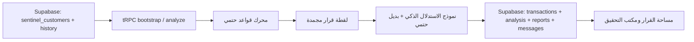

# SentinelAI — تقرير تكامل Supabase المستقل

## القرار المنفذ

اعتمدت **Supabase** مصدر البيانات الدائم لبيانات أعمال SentinelAI. لم تُضف MySQL كقاعدة بديلة للعميل أو التحويل أو التحليل أو المحادثة. يبقى جدول المستخدمين الخاص بقالب المنصة كما هو لخدمة OAuth فقط، بينما جميع بيانات نطاق SentinelAI أصبحت داخل جداول Supabase ذات البادئة `sentinel_`.

> لم تُعدّل أي من جداول AImoney الأصلية. استخدمت كقراءة مرجعية مرة واحدة لترحيل حقائق أعمال مختارة، ثم أصبحت جداول SentinelAI المنفصلة مصدر الحقيقة الوحيد للتطبيق.

## المخطط المعزول

| الجدول | الغرض |
|---|---|
| `sentinel_customers` | ملفات العملاء ومعرف العرض وربط المصدر القديم عند توفره. |
| `sentinel_customer_history` | المتوسط والسجل والبلدان وساعات النشاط من مصدر واحد. |
| `sentinel_beneficiaries` | المستفيدون وعلاقة الثقة الأساسية. |
| `sentinel_websites` | تقييمات النطاقات وسمات الموقع. |
| `sentinel_transactions` | عمليات SentinelAI الدائمة. |
| `sentinel_analysis_runs` | نتيجة المحرك واللقطة المجمدة والـML وسجل المراحل والـpayload الكامل. |
| `sentinel_cases` و`sentinel_alerts` | حالة القضية والتنبيه المرتبط بالتحليل. |
| `sentinel_ai_reports` | التقرير التحليلي ومصدره وحالته. |
| `sentinel_ai_messages` | رسائل محادثة التحقيق وسجل مصدر الرد. |

جميع هذه الجداول منفصلة عن جداول `Customer` و`Transaction` و`CustomerHistory` وغيرها في AImoney. فُعّل Row Level Security عليها، وتستخدم خدمة SentinelAI مفتاح الخادم فقط من دون كشف أي سر للواجهة.

## الترحيل الانتقائي

تم تنفيذ الترحيل من Supabase الأصلي إلى منطقة منفصلة داخل المشروع نفسه بطريقة idempotent؛ يمكن إعادة تشغيله من دون تكرار عبر المفاتيح المرجعية الأصلية. لم يُستورد `data-store.json`، لأنه يمثل مصدرًا محليًا متداخلًا قد يكرر البيانات.

| الكيان | المصدر المقروء | الصفوف المرحّلة | ملاحظة |
|---|---:|---:|---|
| العملاء | 9 | 9 | نُقل معرف العرض عند توفره وربطت ملفات الواجهة به. |
| السجل التاريخي | 6 | 6 | بقيت غياب البيانات صريحًا للعملاء بلا سجل. |
| المستفيدون | 3 | 3 | أضيف مستفيد تشغيل جديد فقط عند تحليل عملية جديدة. |
| المواقع | 2 | 2 | نقلت حقائق المصدر فقط؛ لا مرجع مخترع. |
| المعاملات | 9 | 9 | لم تتجاوز أي معاملة بسبب عميل مفقود. |

بعد الاختبار الحي، أصبحت الجداول المستقلة تحتوي أيضًا على تشغيلات SentinelAI الجديدة والتقارير والرسائل المرتبطة بها. لم تتغير عدادات جداول AImoney الأصلية أثناء الترحيل أو الاختبارات.

## تدفق البيانات النهائي

تقرأ بوابة التحويل قائمة العملاء من `sentinel_customers`، ويقرأ التحليل ملف العميل وخط أساسه من `sentinel_customer_history` قبل استدعاء المحرك. لا يتغير المحرك: يحصل فقط على `CustomerProfile` محمّل من Supabase بدل الثابت المحلي. عند التحليل، تحفظ العملية واللقطة والنتيجة والتقرير. وعند المحادثة، تحفظ رسالتا المستخدم والمساعد وتستعادان عند إعادة فتح العملية أو بعد إعادة تشغيل الخادم.

## التحقق

| التحقق | النتيجة |
|---|---|
| اتصال Supabase | ناجح باستخدام مفتاح خادمي دون طباعة قيمه. |
| تحميل العملاء من Supabase | ناجح؛ أعادت بوابة التحويل ملفات العملاء الدائمة. |
| تحليل حي | ناجح؛ استخدم ملف العميل من Supabase وأعاد قرارًا وتقرير استدلال حيًا. |
| ديمومة التحليل | ناجح؛ حُفظت العملية والتحليل والتقرير في جداول `sentinel_`. |
| ديمومة المحادثة | ناجح؛ حُفظت رسالتا المستخدم والمساعد واستُعيدتا عبر `investigatorHistory`. |
| استقلال AImoney | ناجح؛ بقيت عدادات جداول AImoney الأصلية دون تغيير. |
| TypeScript | ناجح: `pnpm check`. |
| Vitest | ناجح: 51 اختبارًا في 17 ملف اختبار. |
| Production build | ناجح؛ تحذير حجم bundle فقط، دون فشل. |

## ملفات التنفيذ الرئيسية

| الملف | المسؤولية |
|---|---|
| `supabase/20260814_sentinelai_schema.sql` | المخطط المعزول الأولي لجداول SentinelAI. |
| `supabase/20260814_sentinelai_add_demo_identifier.sql` | ربط ملفات العرض بمعرفات العميل الدائمة. |
| `supabase/20260814_sentinelai_add_result_payload.sql` | حفظ لقطة التحليل الكاملة. |
| `scripts/migrateSupabaseToSentinel.mjs` | ترحيل انتقائي قابل لإعادة التشغيل. |
| `server/sentinelSupabase.ts` | قراءة وكتابة SentinelAI داخل Supabase فقط. |
| `server/routers.ts` | تحميل العملاء والتحليل والمحادثة عبر tRPC. |
| `server/sentinelEngine.ts` | يقبل ملف العميل المحمّل من Supabase دون تعديل القواعد. |
| `client/src/pages/Investigation.tsx` | استعادة سجل المحادثة الدائم للمحقق. |

## حدود مقصودة

لم يُرحّل سجل المخاطر والـAI والتدقيق القديم من AImoney، لأن نتيجته مرتبطة بمحرك مختلف وقد توحي بأن SentinelAI اتخذ قرارًا لم يصدر عنه. كذلك لا يعتمد التطبيق على `data-store.json` ولا يكتب في AImoney ولا يستخدم Supabase Storage أو Auth. أي توسعة لاحقة للمراجع أو المواقع أو الرسائل تضاف إلى جداول `sentinel_` فقط.
