# SentinelAI — System Architecture & ITU-T Y.3172 Alignment

> **Enterprise Architecture Blueprint & Machine Learning Pipeline Mapping according to ITU-T Recommendation Y.3172.**  
> **مخطط المعمارية الهندسية الشاملة ومواءمة خط تدفق البيانات مع معايير الاتحاد الدولي للاتصالات ITU-T Y.3172**

---

## 1. End-to-End Pipeline Overview

SentinelAI implements a multi-stage, zero-trust financial risk evaluation pipeline designed for speed, explainability, and regulatory governance:

```
[Data Sources] ──► [Preprocessing & Context Freeze] ──► [Policy Engine & Behavioral Model]
                                                                  │
                                                                  ▼
[Audit Trail Log] ◄── [Certified Human Decision] ◄── [Investigation Desk] ◄── [Regulatory RAG & Sovereign AI]
```

### Flow Sequence
1. **Data Sources (`SRC`):** Transaction intake payloads, 90-day customer historical baselines, merchant domain intelligence, and supervisory regulatory archives.
2. **Collector (`C`):** Secure API gateways ingest transfer requests and initiate context collation.
3. **Preprocessing (`PP`):** Normalizes transfer parameters, calculates statistical deviations ($z$-score, velocity, off-hours timing), masks PII data, and seals the **Immutable Decision Snapshot**.
4. **Model & Policy Engine (`M` & `P`):**
   - **Deterministic Policy Engine (`P`):** Accumulates factor weights across 14 checkpoints and evaluates mandatory compliance override rules.
   - **Isolation Forest Model (`M`):** Generates an unsupervised multi-dimensional anomaly score ($0-100$).
5. **Regulatory RAG & Sovereign AI (`M` / `P`):**
   - **Regulatory RAG:** Retrieves authoritative SAMA, SDAIA, and FATF clauses mapped to active factor codes.
   - **Sovereign Local AI Model (Edge / On-Premise):** Formulates contextual Arabic/English executive analysis bounded by the frozen snapshot.
6. **Decision Distribution (`D`):** Dispatches case dossier and preliminary recommendation to the Operations Workspace and Investigator Desk.
7. **Human Decision Execution:** Certified compliance officer reviews evidence and confirms final disposition (`Approve`, `Hold`, `Manual Review`).
8. **Audit Data Sink (`SINK`):** Cryptographic timestamping and immutable storage of the complete 14-stage audit trail.

---

## 2. ITU-T Recommendation Y.3172 Architecture Mapping

ITU-T Recommendation Y.3172 specifies an architectural framework for machine learning in networks and intelligent processing pipelines. SentinelAI maps directly to the standard functional components:

```mermaid
flowchart TD
    subgraph SRC_LAYER["Data Sources (SRC)"]
        S1["Core Banking Stream"]
        S2["Customer Baseline DB"]
        S3["Domain Threat Lists"]
        S4["Regulatory Knowledge Corpus"]
    end

    subgraph C_PP_LAYER["Collector & Preprocessing (C / PP)"]
        C1["Intake Gateway (C)"]
        PP1["PII Masking & Tokenization (PP)"]
        PP2["Statistical Feature Extractor (PP)"]
        PP3["Cryptographic Context Freezing (PP)"]
    end

    subgraph M_P_LAYER["Model & Policy Pipeline (M / P)"]
        P1["14-Stage Deterministic Policy Accumulator (P)"]
        P2["Mandatory Compliance Override Gate (P)"]
        M1["Isolation Forest Anomaly Model (M)"]
        M2["Sovereign Local AI Reasoning Engine (M)"]
        M3["Vectorized Regulatory RAG Pipeline (M)"]
    end

    subgraph D_LAYER["Decision Distribution (D)"]
        D1["Operations Workspace & Investigator Desk (D)"]
        D2["Interactive Simulation Sandbox (D)"]
        D3["Real-time Alert & Case Dispatcher (D)"]
    end

    subgraph SINK_LAYER["Data Sink (SINK)"]
        SK1["14-Stage Immutable Audit Trail (SINK)"]
        SK2["Dossier PDF / Excel Export Engine (SINK)"]
        SK3["Persistent Supabase Case Ledger (SINK)"]
    end

    SRC_LAYER --> C_PP_LAYER
    C_PP_LAYER --> M_P_LAYER
    M_P_LAYER --> D_LAYER
    D_LAYER --> SINK_LAYER

    style SRC_LAYER fill:#0f172a,stroke:#38bdf8,stroke-width:2px,color:#fff
    style C_PP_LAYER fill:#042f2e,stroke:#14b8a6,stroke-width:2px,color:#fff
    style M_P_LAYER fill:#312e81,stroke:#818cf8,stroke-width:2px,color:#fff
    style D_LAYER fill:#1e1b4b,stroke:#a855f7,stroke-width:2px,color:#fff
    style SINK_LAYER fill:#052e16,stroke:#22c55e,stroke-width:2px,color:#fff
```



### ITU-T Y.3172 Functional Entities Matrix

| Y.3172 Entity | Name in Standard | SentinelAI Implementation | Functional Role |
|:---:|:---|:---|:---|
| **`SRC`** | **Source** | Core Banking Translog, Customer Profile Store, Regulatory Corpus | Produces raw financial, behavioral, and legal data feeds. |
| **`C`** | **Collector** | Ingestion Gateway & Batch Intake Streamer | Gathers transaction metadata and triggers pipeline evaluation. |
| **`PP`** | **Preprocessing** | Statistical Feature Engine & Context Snapshot Freezer | Computes $z$-scores, applies PII tokenization, and seals state. |
| **`M`** | **Model** | Isolation Forest ML + Sovereign Local AI Engine + Regulatory RAG | Infers anomaly probability and synthesizes contextual explanations. |
| **`P`** | **Policy** | 14-Stage Deterministic Policy Engine & Mandatory Override Gate | Applies institutional limits, risk thresholds, and compliance floors. |
| **`D`** | **Decision Distributor** | Operations Workspace, Investigator Desk & Alert Manager | Presents actionable dossiers to human compliance officers. |
| **`SINK`** | **Sink** | Immutable 14-Stage Audit Store, Supabase Case Ledger & PDF Exporter | Permanently archives defensible audit records and dispositions. |

---

## 3. Data Flow & Latency Budget

```
Total Evaluation Budget: < 850 ms
├── C + PP (Intake, Feature Calc, Snapshot): < 4.5 ms
├── P (Deterministic 14-Stage Rule Engine):  < 1.8 ms
├── M (Isolation Forest Inference):          < 4.2 ms
├── M (Regulatory RAG Vector Retrieval):     < 12.0 ms
└── M (Sovereign Local LLM In-Memory):       ~ 780.0 ms (Quantized 4-bit edge)
```

---

<div align="center">
  <sub>Document Reference: ITU-T Y.3172-SEN-2026 · Authored by <strong>SentinelAI Systems Architecture Team</strong></sub>
</div>
